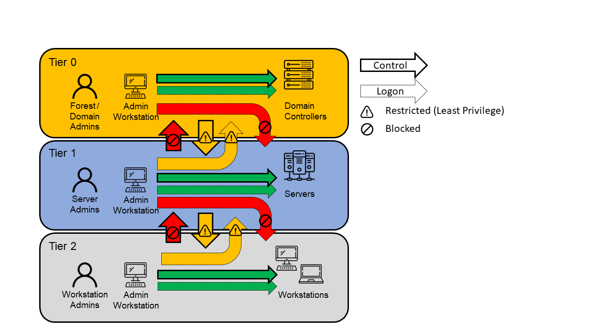
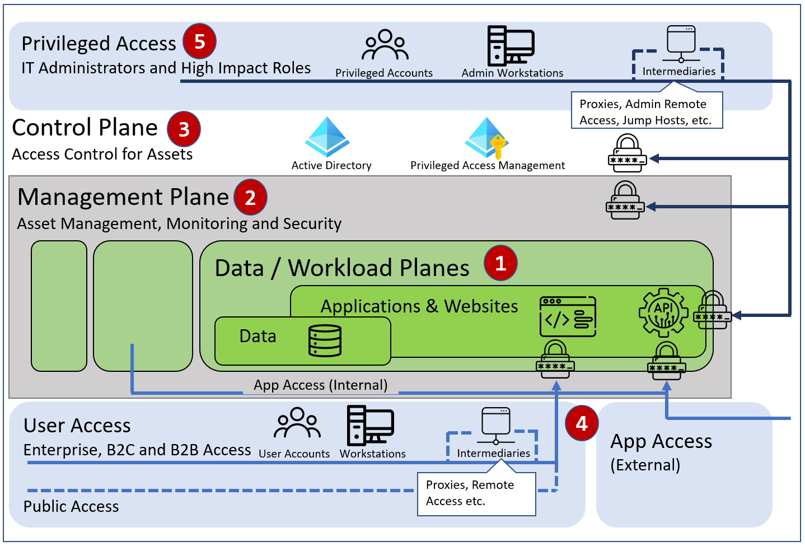

# Security Best Practices for On-Premise Environments

# Table of contents
1. [Introduction](#introduction)
    1. [Active Directory Administrative Tier Model](#adatm)
    2. [Enterprise Access Model](#eam)
2. [Categorization of Measures](#categorization)
3. [Measures](#measures)
    1. [Organizational Measures](#measures_org)
    2. [Configuriational Measures](#measures_config)
    3. [Account & Privilege Management Measures](#measures_acc)
    4. [Password Management Measures](#measures_pw)
    5. [Network Measures](#measures_network)
4. [Tools](#tools)

## Introduction 
This guide aims to help businesses to increase the security in an enterprise Windows Active Directory environment while focusing on the most important points. 
It is based on Microsoft best practices and learnings from dozens of penetration tests conducted by Compass Security in the past.
Implementation guidelines for the different measures are kept to a minimum and references to more detailed guidelines are provided where necessary.

### Active Directory Administrative Tier Model 
Microsofts tiered administrative model was introduced many years ago with the goal to help customers secure their on-premise infrastructure from cyberattacks and malware.
The purpose of this tier model is to protect identity systems (e.g. Active Directory Domain Controllers) using a set of buffer zones between full control of the environment (Tier 0) and the high-risk workstation assets that attackers frequently compromise.   
Dividing the systems and user permissions in the environment into different tiers (Tier 0, Tier 1 and Tier 2) and preventing administrators to interactively login to other tiers reduces the impact of compromise of lower tier systems like workstations.    

> Image adapted from [Microsofts Legacy Tier Model](https://docs.microsoft.com/en-us/security/compass/privileged-access-access-model)
 - **Tier 0** includes accounts, groups and systems that have administrative control of the AD forest. Tier 0 administrators can manage and control assets in all tiers but only log in interactively to Tier 0 assets. I.e. a domain administrator can never interactively log in to a Tier 2 asset.

 - **Tier 1** contains domain member servers and applications with sensitive business data. Tier 1 administrators can access Tier 1 or Tier 0 assets (only network logon) but can only manage Tier 1 or Tier 2 assets. Tier 1 administrators can only log on interactively to Tier 1 assets.

 - **Tier 2** is for end-user devices (e.g. notebooks and workstations). Tier 2 administrators can access all tier assets (network logon) as necessary but can only manage Tier 2 assets. Tier 2 admins can only log in interactively to Tier 2 assets. 

 This guide will help you to implement the important points of the administrative tier model.

### Enterprise Access Model
Nowadays more and more companies are having a hybrid environment, whereas part of the infrastructure is in the cloud and part on-premise. Since the administrative tier model focuses on containing unauthorized escalation of privilege in an on-premises Windows Server Active Directory environment, Microsoft superseded it with the enterprise access model, which is adapted to the hybrid world.

In comparison to the old tier model, the enterprise access model introduces a higher degree of separation between controls over critical business and technical assets. In addition, it also addresses the requirements of a modern enterprise, that spans on-premises, multiple clouds, internal or external user access, and more.
   
> Image adapted from [Microsofts Enterprise Access Model](https://docs.microsoft.com/en-us/security/compass/privileged-access-access-model)    
 - **1. Data / Workload Plane:** Contains the business value of the organization (e.g. Business processes, intellectual property).
 - **2. Management Plane:** Used to manage and support the workloads and the infrastructure they are hosted on.
 - **3. Control Plane:** Provides consistent access control to all systems across the enterprise based on centralized enterprise identity systems (e.g. Active Directory, IAM/PAM), including networking where it is the only/best access control option, such as legacy OT options
 - **4. User and App Access:** Providing the access to the internal users, partners and customers using their workstations or devices (often using remote access solutions) and to applications for process automation (APIs)
 - **5. Privileged Access:** Providing the access to IT staff, developers or other highly privileged users which manage and maintain the systems. Because of the high level of control they provide over business critical assets in the organization, these pathways must be strictly protected against compromise.

The complete Microsoft documentation about the enterprise access model can be found here:   
https://docs.microsoft.com/en-us/security/compass/privileged-access-access-model

While the measures in this guide primarily focus on the on-premises environment, they will also help you to implement some key points of the enterprise access model.

## Categorization of Measures
The measures are categorized, based on how they need to be addressed.   
The following categories of measures are defined:   
 - **Organizational Measures:** Defining processes, training of employees etc.
 - **Configurational Measures:** Settings which have to be configured on workstations and servers.
 - **Account & Privilege Management Measures:** Creation of accounts and allocation of permissions.
 - **Password Management Measures:** Defining and enforcing of strong password policies.
 - **Network Measures:** Segregation of network, use of firewalls, etc.

## Measures

### [Organizational Measures](measures_org.md) 
 Recommendation | Purpose | Priority 
----------|-------------|------:
 [Implement monitoring](measures_org.md#implement-monitoring) | Detect security issues early and enable forensic readiness | A 
 [Perform regular off-site backups](measures_org.md#perform-regular-off-site-backups) | Data restoration after ransomware or similar attacks | A 
 [Implement patch management process](measures_org.md#implement-patch-management-process) | Mitigate exploits of known vulnerabilites | A 
 [Maintain Hardware and Software Inventory](measures_org.md#maintain-hardware-and-software-inventory) | Be able to distinguish between legitimate and malicious components  | A
 [Use group based access control](measures_org.md#use-group-based-access-control) | Limit access from compromised accounts | A 
 [Separate Tier-0 management services](measures_org.md#separate-tier-0-management-services) | Prevent lateral movement to Tier-0 | A 
 [Introduce privileged access workstations](measures_org.md#introduce-privileged-access-workstations) | Limit lateral movement from the workstation tier to the server and domain controller tier | A 
 [Do regular reviews & vulnerability assessments](measures_org.md#do-regular-reviews---vulnerability-assessments) | Detect misconfigurations, excessive privileges, unpatched or outdated systems | A 
 [Define emergency processes](measures_org.md#define-emergency-processes) | Predefined plans and trained employees allow efficient response to a cyberattack | A 
 [Train employees on IT security best practices](measures_org.md#train-employees-on-it-security-best-practices) | Higher awareness from cyber attacks | A 
 [Use personalized accounts](measures_org.md#use-personalized-accounts) | Enable accountability and traceability | B 
 [Implement four eyes principle](measures_org.md#implement-four-eyes-principle) | Mitigate internal fraud or mistakes in business tasks | B 
 [Use golden images](measures_org.md#use-golden-images) | Avoid configuration mistakes by providing an identical security baseline | B 

### [Configurational Measures](measures_config.md)
 Recommendation | Purpose | Priority 
----------|-------------|------:
 [Install Antivirus](measures_config.md#install-edr-or-antivirus) | Block malware and common attacks | A 
 [Enforce SMB & LDAP signing](measures_config.md#enforce-smb-and-ldap-signing) | Limit privilege escalation within the internal network | A 
 [Disable or restrict macros](measures_config.md#restrict-macros) | Block malware which is spread via office documents | A 
 [Enforce Multi-Factor Authentication](measures_config.md#enforce-multi-factor-authentication) | Limit malicious access to systems and services | A 
 [Enforce BitLocker on clients](measures_config.md#enforce-bitlocker-on-clients) | Protect data on harddisks from malicious access | A 
 [Implement hardening of domain controllers](measures_config.md#implement-hardening-of-domain-controllers) | Limit attack surface on domain controllers | A 
 [Implement hardening of other systems](measures_config.md#implement-hardening-of-other-systems)  | Limit attack surface on all systems | A 
 [Deploy strictly configured host-based firewalls](measures_config.md#deploy-strictly-configured-host-based-firewalls) | Limit lateral movement within the internal network | A 
 [Disable Spooler service](measures_config.md#disable-spooler-service) | Limit privilege escalation within the internal network | A 
 [Enable detailed audit logs](measures_config.md#enable-detailed-audit-logs) | Traceability of events and evidence for forensic analysis | A 
 [Raise Active Directory function level](measures_config.md#raise-active-directory-function-level) | Enable new security mechanisms introduced with newer Windows versions | B 
 [Enable Credential Guard](measures_config.md#enable-credential-guard) | Protect stored credentials on systems from certain attacks | B 
 [Enable AppLocker](measures_config.md#enable-applocker) | Limit execution of software and tools | B 
 [Limit cached credentials](measures_config.md#limit-cached-credentials) | Reduce the exposure of password hashes to password cracking attacks | C 

### [Account & Privilege Management Measures](measures_acc.md)
 Recommendation | Purpose | Priority 
----------|-------------|------:
 [Remove local administrator rights](measures_acc.md#remove-local-administrator-rights) | Reduce the attack surface and limit impact of malware | A 
 [Assign permissions according to the Least Privilege Principle](measures_acc.md#assign-permissions-according-to-the-least-privilege-principle) | Limit permission abuse & privilege escalation attacks | A 
 [Minimize high privileged administrator accounts](measures_acc.md#minimize-high-privileged-administrator-accounts) | Limit privilege escalation attacks within the internal network | A 
 [Implement least-privilege administrative model](measures_acc.md#implement-least-privilege-administrative-model) | Limit privilege escalation attacks within the internal network | A 
 [Deny logon to other tiers](measures_acc.md#deny-logon-to-other-tiers) | Limit privilege escalation attacks within the internal network | A 
 [Add sensitive accounts to protected users group](measures_acc.md#add-sensitive-accounts-to-protected-users-group) | Protect highly privileged accounts from credential theft | A 
 [Disable high privileged account delegation](measures_acc.md#disable-high-privileged-account-delegation) | Protect highly privileged accounts from credential theft | A 
 [Configure Exchange split permissions](measures_acc.md#configure-exchange-split-permissions) | Limit privilege escalation attacks within the internal network | B 
 [Review unconstrained delegation systems](measures_acc.md#review-unconstrained-delegation-systems) | Reduce risk of credential theft | B 
 [Limit users who can add systems to domain](measures_acc.md#limit-users-who-can-add-systems-to-domain) | Limit privilege escalation attacks within the internal network | B 
 [Use group managed service accounts](measures_acc.md#use-group-managed-service-accounts) | Reduce the possibility of password cracking | C 

### [Password Management Measures](measures_pw.md)
 Recommendation | Purpose | Priority 
----------|-------------|------:
 [Enforce strong password policy](measures_pw.md#enforce-strong-password-policy) | Reduce the possibility of password guessing or password cracking | A 
 [Use unique local administrator credentials](measures_pw.md#use-unique-local-administrator-credentials) | Limit lateral movement within the internal network | A 
 [Require password for every account](measures_pw.md#require-password-for-every-account) | Limit compromise of accounts and systems | A 
 [Change default credentials](measures_pw.md#change-default-credentials) | Limit compromise of accounts and systems | A 
 [Force change of initial passwords](measures_pw.md#force-change-of-initial-passwords) | Reduce the possibility of password guessing | A 
 [Store credentials securely](measures_pw.md#store-credentials-securely) | Limit compromise of accounts and systems | A 
 [Configure account lockout](measures_pw.md#configure-account-lockout) | Limit compromise of accounts and systems | A 
 [Configure strong password on service accounts with SPN](measures_pw.md#configure-strong-password-on-service-accounts-with-spn) | Reduce the possibility of offline password cracking | A 
 [Review accounts with never expiring password](measures_pw.md#review-accounts-with-never-expiring-password) | Limit compromise of accounts | B 
 [Enable Kerberos Pre-Authentication](measures_pw.md#enable-kerberos-pre-authentication) | Reduce the possibility of offline password cracking | B 
 [Change krbtgt password regularly](measures_pw.md#change-krbtgt-password-regularly) | Limit Golden Ticket attacks | B 

### [Network Measures](measures_network.md)
 Recommendation &nbsp; &nbsp; &nbsp; &nbsp; &nbsp; &nbsp; &nbsp; &nbsp; &nbsp; &nbsp; &nbsp; &nbsp; &nbsp; &nbsp; &nbsp; &nbsp; &nbsp; &nbsp; &nbsp; &nbsp; &nbsp; &nbsp; &nbsp; &nbsp; &nbsp; &nbsp; &nbsp; &nbsp; &nbsp; &nbsp; &nbsp; | Purpose &nbsp; &nbsp; &nbsp; &nbsp; &nbsp; &nbsp; &nbsp; &nbsp; &nbsp; &nbsp; &nbsp; &nbsp; &nbsp; &nbsp; &nbsp; &nbsp; &nbsp; &nbsp; &nbsp; &nbsp; &nbsp; &nbsp; &nbsp; &nbsp; &nbsp; &nbsp; &nbsp; &nbsp; &nbsp; &nbsp; &nbsp; &nbsp; &nbsp; &nbsp; &nbsp; &nbsp; | Priority 
----------|-------------|------:
 [Implement network segmentation & segregation](measures_network.md#implement-network-segmentation---segregation) | Limit lateral movement within the internal network | A 
 [Use mail gateway with malware detection](measures_network.md#use-mail-gateway-with-malware-detection) | Prevent delivery of malware via email to the end user | A 
 [Secure WiFi networks](measures_network.md#secure-wifi-networks) | Limit attacks on the internal network | A 
 [Exclusively use encrypted protocols](measures_network.md#exclusively-use-encrypted-protocols) | Limit eavesdropping on the internal network | A 
 [Restrict outbound traffic and deploy filtering proxy](measures_network.md#restrict-outbound-traffic-and-deploy-filtering-proxy) | Detect and block malicious connections | A 
 [Deploy Network Access Control (NAC)](measures_network.md#deploy-network-access-control--nac-) | Limit network access of malicious devices | B 
 [Deploy DNS sinkhole](measures_network.md#deploy-dns-sinkhole) | Limit malicious DNS queries | C 

## Tools 
The following tools can be helpful for identifying issues in a network.

***Bloodhound***   
Collects information about accounts, relationships and permissions in an Active Directory. 
The following blog article can help you to get started with the tool: https://blog.compass-security.com/2019/12/finding-active-directory-attack-paths-using-bloodhound/   
URL: https://github.com/BloodHoundAD/BloodHound

***Snaffler***   
This tool can be used to search shares and local drives for sensitive data (specific file types and keywords or patterns within files).   
URL: https://github.com/SnaffCon/Snaffler

***PingCastle***   
Generates a report about different configurations and policies (e.g. password policies) in the Active Directory.   
URL: https://www.pingcastle.com

***Nmap***   
Nmap is a tool to scan networks for hosts and services by sending packets and analyzing the response.   
URL: https://nmap.org/

***CIS Benchmarks***   
The Center for Internet Security (CIS) provides benchmarks and tools to verify security best practices for different operating systems and services.    
URL: https://www.cisecurity.org/cis-benchmarks/

More tools can be found on our Security Resources link collection on GitHub:    
https://git.io/secres